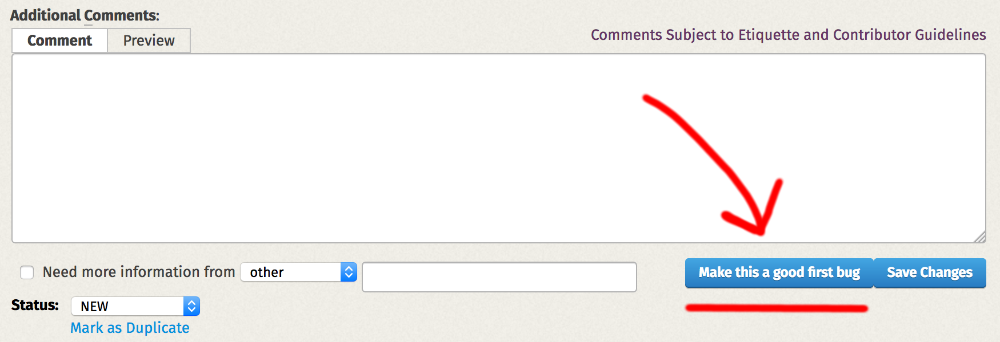
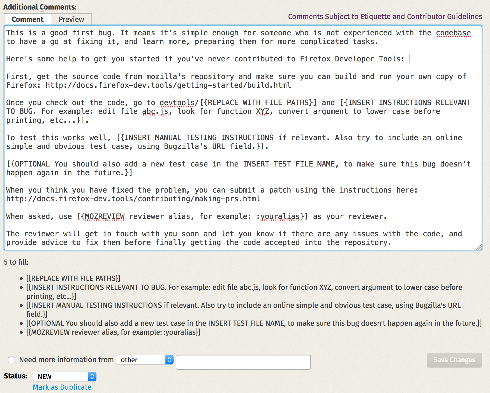

# good-first-bugsify

This is a WebExtension to help you mark Firefox Developer Tools bugs in Bugzilla as good first bugs.

*For potential contributors*, this helps them discover bug opportunities easily, and it is also clearer to them what needs to be done. For people who like to play and experiment with code before they dare asking in forums or chats, this is very important.

*For Developer Tools bug triagers*, it alleviates some of the hassle that involves turning a bug into actionable, by providing a template with the repetitive information that needs to be present in a bug, and allowing them to focus on describing what needs to be done for _that_ bug only. Not having to think of a structure each time also frees mental space that you'd otherwise spend agonising over if you maybe forgot to add something to the bug description.

So it's a win/win for everyone! :-)

## Installing

### From addons.mozilla.org

You can install it from [its page](https://addons.mozilla.org/en-US/firefox/addon/good-first-bugsify/) in addons.mozilla.org.

### From source

If you want to contribute, you can also check out the code and run it locally.

To get the code, clone this repository first:

```bash
git clone https://github.com/devtools-html/good-first-bugsify.git
```

Then open a new tab and go to [about:debugging#addons](about:debugging#addons) in your Firefox browser. Click on the `Load Temporary Add-on` button, and navigate to the folder that contains the source code you just downloaded.

Select any file on the folder to load the add-on temporarily (it will be unloaded when you close Firefox or if you remove it using its `Remove` entry).

You can also use the [web-ext command line tool](https://developer.mozilla.org/en-US/Add-ons/WebExtensions/Getting_started_with_web-ext) to do this and more, such as automatic reload when you change the code, which you might find handy while developing.

## Using the add-on

Once installed, each time you go to a bug page in Mozilla's Bugzilla installation (while logged in), a `Make this a good first bug` button will be inserted alongside the `Save Changes` button that allows you to send a comment to the bug.



When you click the button, a number of things will happen:

1. If the bug was not marked as `good-first-bug` yet, we add that string to the `keywords` field in the form.
2. We insert a skeleton response into the `comment` field. This helps you make the bug actionable by giving you a template structure with most of the links to documentation such as getting started and testing, and also leaves a bunch of gaps for you to fill in with data relevant to this specific bug.
3. We disable the `Save changes` button until you fill in all the gaps AND remove the last line in the comment. This is to ensure you mark bugs as 'good' very intentionally, and provide all the required data.



## Contributing and code walkthrough

The code is all in [main.js](./main.js) right now.

Fancy? No! Simple? Yes! And it has inline comments! Wow!

### `insertButton`

This function inserts the `Make this a good first bug` button *if the user is logged in*. (Otherwise, what is the point? :))

### `goodFirstBugsify`

This function is executed when the button is clicked. It performs the steps described in *Using the add-on*.

Of special interest for Developer Tools triagers, or if you want to use this add-on as the base for your own _good-first-bugsify_ project, it's the *comment template*, which is introduced by setting `commentArea.value`. If you wanted to modify the contents of the template, this would be the place.

`TEXTAREA` elements respect whitespace, so the indentation in this place of the code is a bit awkward, but with a reason. Follow the same style if you modify this part of the code, to avoid weirdnesses.

### `setCommitEnabled(boolean)`

This function sets the status of the `Save changes` button: `true` for enabled, `false` for disabled. No surprises here.

The button is disabled using its `disabled` HTML attribute. It also is given a greyed out appearance using CSS, because otherwise it's impossible to notice that it is disabled. This is because the Bugzilla theme specifies colours and backgrounds for the form elements, which makes them lose their native styling (if they didn't specify this, the button would look disabled as soon as the `disabled` attribute was present).

_Anecdata:_ the button is called `commit` internally! Bugzilla goes back _a very long way_, and in the days of yore it seemingly was a good idea to finish forms using robotic-sounding commands such as COMMIT or SUBMIT DATA.
